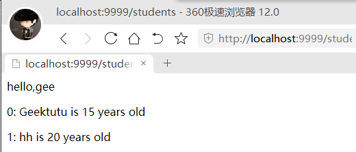

# 06.模板_Template
* 实现静态资源服务
* 支持HTML模板渲染(服务端渲染)
* Ref: [Go语言动手写Web框架 - Gee第六天 模板(HTML Template)](https://geektutu.com/post/gee-day6.html)
## 客户端渲染与服务端渲染
* Ref: [浅谈服务端渲染(SSR) - 简书](https://www.jianshu.com/p/10b6074d772c), [服务端渲染 vs 客户端渲染 - 掘金](https://juejin.cn/post/6844903512296390664), [聊一聊服务端渲染和客户端渲染 - InfoQ](https://www.infoq.cn/article/2017/05/server-render-client-side)
* 客户端渲染(CSR): HTML仅仅作为静态文件, 客户端端在请求时, 服务端不做任何处理, 直接以原文件的形式返回给客户端客户端. 然后客户端根据 html 上的 JavaScript, 生成 DOM 插入HTML.
* 服务端渲染(SSR): 服务端在返回 HTML 之前, 在特定的区域、符号里用数据填充, 再给客户端, 客户端只负责解析 HTML.
* 个人理解来看, 客户端渲染时, 服务器返回给客户端的网页客户端并不能直接进行渲染,是链接至js的空文档, 需要进行将其中的脚本等资源再向服务端请求得到后才能对网页进行渲染. 而服务端渲染时, 服务端返回给的客户端的是已做好准备并可进行渲染的页面 HTML. 因此, 服务端渲染时客户端所需要完成的工作减少, 首屏渲染会更快, 也更利于爬虫服务; 当然其也存在相应的缺点.
* 在此只是对两种渲染方式进行介绍. 在Gee框架中, 实现了对服务端渲染的支持.

## 静态文件服务
### 标准库实现
标准库`net/http`中实现了静态资源服务服务.
#### 标准库函数说明
* Ref: [Go标准库-net/http](https://studygolang.com/static/pkgdoc/pkg/net_http.htm)
##### `func FileServer`
```go
func FileServer(root FileSystem) Handler
```
* 返回一个使用`FileSystem`接口`root`提供文件访问服务的HTTP处理器`http.Handler`. 要使用操作系统的`FileSystem`接口实现. 可使用`http.Dir`.
    * `type FileSystem interface`: 文件系统接口实现了方法`Open()`, 可对一系列命名文件进行访问.
    * `type Dir string`: `Dir`使用限制到指定目录树的本地文件系统实现了`http.FileSystem`接口. 空Dir被视为".", 即代表当前目录.
##### `func StripPrefix`
```go
func StripPrefix(prefix string, h Handler) Handler
```
* 返回一个处理器`http.Handler`, 该处理器会将请求的`URL.Path`字段中给定前缀`prefix`去除后再交由`h`处理. `StripPrefix`会向`URL.Path`字段中没有给定前缀的请求回复404 page not found.
### 标准库使用
以如下的项目文件结构为例:
```
main.go
static/
|-- css
    |-- demo.css
    file1.txt
```
使用以下代码, 在浏览器输入 `http://localhost:9999/`, 可看到如下图类似文件系统的页面, 而页面指向的文件目录即为`http.Dir()`里的参数`"static/"`, 若将其改为空字符串`""`, 则是指向上次的当前项目目录.
```go
func main() {
	http.ListenAndServe(":9999", http.FileServer(http.Dir("static/")))
}
```
其中, `http.Dir()`函数指定了一个目录(该路径可以为相对项目的相对路径, 也可以是绝对路径), `http.FileServer()`创建了一个文件系统处理器`http.Handler`, 从而达到下图的效果.
.

使用函数`http.StripPrefix()`可以在路径中加入额外的前缀.
例如如下代码, 函数`http.StripPrefix()`的第一个参数`"/files/`即额外的前缀, 在浏览器输入`http://localhost:9998/files/`, 同样能看到 `"static"`路径下的文件, 如下图.
```go
func main() {
	http.ListenAndServe(":9998",
		http.StripPrefix("/files/",
			http.FileServer(http.Dir("static/"))))
}
```
函数`http.StripPrefix()`的作用便是将请求的原本路径中去除第一个参数的字符串部分, 然后再交给第二个参数指向的处理器`http.Handler`处理并返回.

如上, 实际上便实现了一个简单的静态文件服务器.
### 框架实现
要进行服务端渲染, 需要支持JS、CSS等静态文件. 这些静态文件一般会统一放置在服务器的某个目录下. 当用户利用URI对该静态文件发起请求时, 服务器需要将请求的路由映射到其主机的实际路径, 从而将静态文件返回. 
比如路径`/assets/js/demo.js`可以匹配路由规则`/assets/*filepath`. 参数`filepath`对应的`js/demo.js`即为该静态文件的"相对地址", 需要映射到服务器的某个实际路径如`/usr/web/js/demo.js`, 才能找到文件将其返回.
在Gee框架中, 只需要完成请求的路径的解析, 并映射到服务器的真实路径. 随后静态文件的返回由`net/http`中提供的函数实现.
* `Static()`函数是给用户的接口, 用户可以将服务器磁盘上的某个文件目录`root`映射到路由`relativePath`上.
* `createStaticHandler()`函数返回一个匿名处理函数`HandlerFunc`. 在返回前使用`http.StripPrefix()`函数构造一个文件处理器, 用于将请求的路由映射到实际路径. 而返回的处理函数有两部分作用, 一是检查请求的静态文件在实际路径下是否存在, 二是执行服务器接口函数`ServeHTTP()`以达到文件访问的目的.
#### gee.go
/day6/gee/gee.go

```go
//创建静态文件处理器
func (group *RouterGroup) createStaticHandler(relativePath string, fs http.FileSystem) HandlerFunc {
	//绝对路径,由路由分组前缀和相对路径组成
	absolutePath := path.Join(group.prefix, relativePath)
	//文件服务器:会将请求的URL路径中"绝对路径"去除后,交由fs文件处理器处理
	fileServer := http.StripPrefix(absolutePath, http.FileServer(fs))
	//返回判断文件是否存在并执行文件系统服务的函数
	return func(c *Context) {
		file := c.GetParam("filepath") //获取文件路径
		//判断文件是否能打开(存在)
		if _, err := fs.Open(file); err != nil {
			c.SetStatus(http.StatusNotFound)
			return
		}
		fileServer.ServeHTTP(c.Writer, c.Req) //执行服务器接口函数
	}
}

//添加静态文件路由
//relativePath是文件的相对路径,root是映射到的项目目录
func (group *RouterGroup) Static(relativePath string, root string) {
	//静态文件处理函数
	handler := group.createStaticHandler(relativePath, http.Dir(root))
	//静态文件的模式字符串
	urlPattern := path.Join(relativePath, "/*filepath")
	//添加路由
	group.GET(urlPattern, handler)
}
```

### 框架使用
/day6/demo.go
```go
package main

import "gee"

func main() {
	r := gee.New()
	r.Static("/assets", "D:\\Install")
	r.Run(":9999")
}
```
该部分实现了静态资源访问. 使用`Static()`方法将路由路径 `/assets` 映射到了实际路径 `D:\\Install`上.
假定存在文件 `D:\\Install\01.txt`, 则可以使用 `http://localhost:9999/assets/01.txt` 对文件进行访问.
* 注: 需要说明的是, 在框架中路径路由功能是框架本身实现的, 静态资源访问时只能直接访问文件, 而不能访问目录. 因此, 使用路由 `http://localhost:9999/assets/` 并不能达到和上述标准库静态资源访问一样可以看到 `D:\\Install`路径下所有文件的效果. 因为在路由匹配过程中, 上述路由的前缀字符串为 `{ "", "assets", ""}`这三个, 而最后一个是空字符串, 在路由时会返回空节点, 从而最终返回 404. 

## HTML模板渲染
### 标准库实现
* Ref: [Go语言标准库之http/template - 李文周的博客](https://www.liwenzhou.com/posts/Go/go_template/#autoid-1-0-0), [\[译\]Golang template 小抄 - 鸟窝](https://colobu.com/2019/11/05/Golang-Templates-Cheatsheet/), [Go 模板嵌套最佳实践 - 鸟窝](https://colobu.com/2016/10/09/Go-embedded-template-best-practices/)
标准库 `html/template` 实现了数据驱动的模板, 用于生成可防止代码注入的安全的HTML内容.
#### 模板文件
模板文件可以理解为事先定义好的HTML文档文件, 简称为模板; 而模板渲染的作用机制可以简单理解为文本替换操作, 即使用相应的数据去替换模板文件中事先设置的标记. 
* 在Go中, 模板文件一般以`.tmpl`或`.tpl`等作为后缀名, 必须使用`UTF8`编码.
* 模板文件的基本语法是 HTML.
* Go程序可以通过相应的函数传递数据到模板中. 在模板中, 使用双大括号 `{{`和 `}}` 包裹和标识传入的数据; 在双大括号中使用 `.`来访问传入的数据, 也可以使用 `..FieldName` 来访问数据的成员.
* 传给模板的数据可存在模板定义的变量中, 在整个模板中均能访问. 使用 `$` 标识定义的变量, 例如: `$obj := .`便将传给模板的数据存在变量`obj`中.
* 模板还支持`if/else`, `range`, 移除空格等操作, 在此不多赘述.

#### 标准库函数说明
* Ref: [Go标准库 - html/template](https://studygolang.com/static/pkgdoc/pkg/html_template.htm)
##### `func New`
```go
func New(name string) *Template
```
* 创建一个名为`name`的模板
##### `func (*Template) Funcs`
```go
func (t *Template) Funcs(funcMap FuncMap) *Template
```
* 向模板`t`的函数字典里加入参数`funcMap`内的键值对. 若`funcMap`某个键值对的值不是函数类型或者返回值不符合要求会`panic`. 但可以对`t`函数列表的成员进行重写. 方法返回模板`t`以便进行链式调用.
    * `type FuncMap map[string]interface{}`: `FuncMap`类型定义了函数名字符串到函数的映射, 每个函数都必须有1到2个返回值, 若有2个则后者必须是`error`接口类型; 若有2个返回值的方法返回的`error`非`nil`, 模板执行会中断并返回给调用者该错误.
##### 解析模板
```go
func (t *Template) Parse(src string) (*Template, error)
```
* `Parse`: 将字符串`src`解析为模板, 即此处字符串`src`为模板的内容.

```go
func (t *Template) ParseFiles(filenames ...string) (*Template, error)
```
* `ParseGlob`: 解析`filenames`指定的文件里的模板定义, 并将解析结果与`t`关联. 至少要提供一个文件. 即此处字符串`filenames`为模板文件的名.
 
```go
func (t *Template) ParseGlob(pattern string) (*Template, error)
```
* `ParseGlob`: 解析匹配模式字符串`pattern`的文件里的模板定义, 并将解析结果与`t`关联. 至少要存在一个匹配的文件. 此处字符串`pattern`为模式字符串, 例如`/template/*.tmpl`等, 相当于匹配模板路径.
##### `func Must`
```go
func Must(t *Template, err error) *Template
```
* 用于包装返回`(*Template, error)`的函数/方法调用, 它会在`err`非`nil`时`panic`, 一般用于变量初始化.

##### 执行模板
```go
func (t *Template) Execute(wr io.Writer, data interface{}) error
```
* `Execute`: 将解析好的模板应用到`data`上, 并将输出写入`wr`. 一般配合`Parse()`函数使用.

```go
func (t *Template) ExecuteTemplate(wr io.Writer, name string, data interface{}) error
```
* `ExecuteTemplate`: 类似`Execute`, 但是使用名为`name`的`t`关联的模板产生输出. 一般配合`ParseFiles()`和`ParseGlob()`函数使用.
### 标准库使用
以如下的模板文件`demo.tmpl`为例:
```html
<html lang="zh-CN">
<body>
<h1>This is a template demo</h1>
<p>Hello {{.}}</p>
</body>
</html>
```
执行以下代码, 可以访问 `http://localhost:9990/`获取到的便是下图已经渲染的文件.

```go
func main() {
	http.HandleFunc("/", testTpl)
	log.Fatal(http.ListenAndServe(":9990", nil))
}

func testTpl(w http.ResponseWriter, req *http.Request) {
	tpl := template.New("demo") //创建一个模板对象
	t := template.Must(         //Must用于初始化解析后的模板
		//解析模板文件
		tpl.ParseFiles("./templates/demo.tmpl"))
	//执行模板渲染
	t.ExecuteTemplate(w, "demo.tmpl", "test")
}
```
路由处理函数中使用`New()`创建了一个模板对象; 同时使用`ParseFiles()`来指定模板文件(此处可以添加多个文件), **注意要用`Must()`函数对解析后的模板进行包装**. 然后使用`ExecuteTemplate()`选择具体的模板文件进行执行. 可以看到, 传入的参数`test`成功的渲染到了HTML中.


对于函数`Funcs()`, 其功能是向模板中添加自定义模板渲染函数, **必须在解析模板前使用**. 以如下代码为为例, 此时同样访问 `http://localhost:9990/` 可以得到如下图效果.
```go
func main() {
	http.HandleFunc("/", testTpl)
	log.Fatal(http.ListenAndServe(":9990", nil))
}

func testTpl(w http.ResponseWriter, req *http.Request) {
	tpl := template.New("demo") //创建一个模板对象
	t := template.Must(         //Must用于初始化解析后的模板
		//解析模板文件
		tpl.Funcs(
			template.FuncMap{
				"fun": func(arg string) (string, error) {
					return "hello " + arg, nil
				},
			}).Parse("<html><body>{{fun .}}</body></html>"))
	//执行模板渲染
	t.Execute(w, "test")
}
```
在该代码中, 模板是用字符串表示的, 因此使用`Parse()`函数渲染; 在渲染前添加自定义函数`fun`, 功能为返回"hello". 然后使用`Must()`初始化后使用`Execute()`执行. 
在模板文档解析时, **`Funcs()`添加的自定义函数会先执行, 然后将函数返回结果输出到模板文件相应位置, 进行替换**.


### 框架实现
Gee框架的模板渲染本质上是利用的标准库`html/template`提供的函数完成的. 支持添加自定义函数, 以及设定多个模板进行有选择的匹配.
#### 框架主体部分
在该框架中, 模板渲染相关的功能设置为由框架主体`Engine`负责, 因此相关变量和函数是添加在`Engine`下的.
* `Engine`中添加了两个成员`htmlTemplates *template.Template`和 `funcMap template.FuncMap`: 前者是已经解析好的模板对象的指针, 将所有模板加载进内存, 用于渲染HTML; 后者是自定义函数映射表, 用于记录全部添加的自定义函数.
* `SetFuncMap()`方法是用户自定义添加模板函数的接口函数, 将自定义函数添加到`Engine.funcMap`字段. 由于直接利用的标准库, 因此自定义函数需要符合标准库的要求.
* `LoadHTML()`方法用于用户添加模板文件目录以及初始化模板. 需说明的是, 该函数添加模板底层是通过`ParseGlob()`, 因此其参数是匹配模板路径的模式字符串, 而不是模板文件名或者内容.
##### gee.go
/day6/gee/gee.go
```go
//框架主体结构体
type Engine struct {
	*RouterGroup
	router        *router
	groups        []*RouterGroup
	htmlTemplates *template.Template //解析后的模板对象
	funcMap       template.FuncMap   //自定义函数映射表
}

//添加自定义模板渲染函数
func (engine *Engine) SetFuncMap(funcMap template.FuncMap) {
	engine.funcMap = funcMap
}

//加载HTML模板
func (engine *Engine) LoadHTMLGlob(pattern string) {
	engine.htmlTemplates = template.Must(	//模板初始化
		template.New("").		//新建匿名模板
			Funcs(engine.funcMap).	//加载添加的自定义函数
			ParseGlob(pattern))		//解析模板文件
}
```
#### 上下文部分
模板的初始化由框架主体`Engine`负责. 而对于具体的模板渲染, 则是关系到具体的请求上下文`Context`. 在此处选择了调整`(*Context).HTML()`方法, 使之支持根据模板文件名选择模板进行渲染.
* 在结构体`Context`中添加了指向框架主体的指针`engine *Engine`, 因为模板对象都记录在`Engine`中, 调用时需要指向`Engine`. 同时, 在`(*Engine).ServeHTTP`添加了一行代码, 用于`Context.engine`的初始化.
* `HTML()`函数部分, 由原本直接输出给定的HTML字符串, 改为了使用模板渲染.
##### context.go
/day6/gee/context.go
```go
func (c *Context) HTML(code int, name string, data interface{}) {
	c.SetHeader("Content-Type", "text/html")
	c.SetStatus(code)
	//执行模板
	if err := c.engine.htmlTemplates.ExecuteTemplate(c.Writer, name, data); err != nil {
		//c.Fail(500, err.Error())
		//此处存在和JSON相同的问题,
		//由于已经使用SetStatus()设置了Header的状态码, 
		//因此模板执行失败时,Fail()中调用的JSON便无法对Header进行修改
		log.Fatal("Template Execute Error")
		panic(err)
	}
}
```
##### gee.go
/day6/gee/gee.go
```go
func (engine *Engine) ServeHTTP(w http.ResponseWriter, req *http.Request) {
	c := newContext(w, req)
	for _, group := range engine.groups {
		if strings.HasPrefix(c.Path, group.prefix) {
			c.handlers = append(c.handlers, group.middlewares...)
		}
	}
	c.engine = engine	//初始化上下文的Engine指针
	engine.router.handle(c)
}
```

### 框架使用
项目目录结构:
```
main.go
static/
|-- css
    |-- demo.css
    file1.txt
templates/
|-- arr.tmpl
    css.tmpl
    custom_func.tmpl
```
模板文件:
/day6/static/css/demo.css
```css
p{
    color: orange;
    font-weight: 700;
    font-size: 20px;
}
```
/day6/templates/arr.tmpl
```html
<!--templates/arr.tmpl-->
<html>
    <body>
        <p>hello,{{.title}}</p>
        {{range $index, $ele := .stuArr}}
        <p> {{$index}}:{{$ele.Name}} is {{$ele.Age}} years old</p>
        {{end}}
    </body>
</html>
```
/day6/templates/css.tmpl
```html
<html>
    <head>
        <link rel="stylesheet" href="/assets/css/demo.css">
    </head>
    <body>
        <p>css is loaded</p>
    </body>
</html>
```
/day6/templates/custom_func.tmpl
```html
<!-- templates/arr.tmpl -->
<html>
    <body>
        <p>hello, {{.title}}</p>
        <p>Date: {{.now | FormatAsData}} </p>
    </body>
</html>
```
/day6/main.go
```go
package main

import (
	"fmt"
	"gee"
	"html/template"
	"net/http"
	"time"
)

type student struct {
	Name string
	Age  int
}

func FormatAsData(t time.Time) string {
	year, month, day := t.Date()
	return fmt.Sprintf("%d-%02d-%02d", year, month, day)
}

func main() {
	r := gee.New()
	//添加自定义模板函数
	r.SetFuncMap(template.FuncMap{
		"FormatAsData": FormatAsData,
	})
	//加载模板目录
	r.LoadHTMLGlob("templates/*")
	//设置静态资源
	r.Static("/assets", "./static")
	stu1 := &student{Name: "Geektutu", Age: 15}
	stu2 := &student{Name: "hh", Age: 20}
	r.GET("/", func(c *gee.Context) {
		//使用css.tmpl渲染
		c.HTML(http.StatusOK, "css.tmpl", nil)
	})
	r.GET("/students", func(c *gee.Context) {
		//使用arr.tmpl渲染
		c.HTML(http.StatusOK, "arr.tmpl", gee.H{
			"title":  "gee",
			"stuArr": [2]*student{stu1, stu2},
		})
	})
	r.GET("/data", func(c *gee.Context) {
		//使用custom_func.tmpl渲染
		c.HTML(http.StatusOK, "custom_func.tmpl", gee.H{
			"title": "gee",
			"now":   time.Date(2021, 2, 1, 0, 0, 0, 0, time.UTC),
		})
	})
	r.Run(":9999")
}
```
测试效果:
http://localhost:9999/


http://localhost:9999/students


http://localhost:9999/data

可以看到, 该部分实现了模板渲染, 模板根据传入的数据渲染出特定样式. 
其中, 在`css.tmpl`模板中, 使用了链接到了静态资源 `/assets/css/demo.css`, 而这也和前文静态资源访问联系起来, 通过`Static()`方法设置了静态资源的路径映射, 使得模板中可以直接访问静态资源进行加载.
