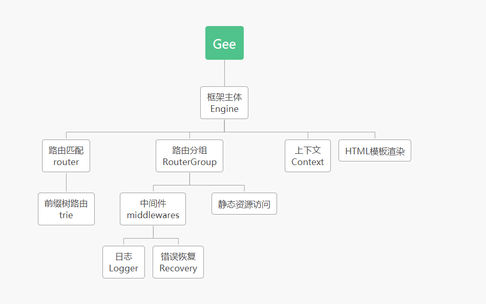

# 08.Gee总结
## 简单总结
该项目是参照 [7天用Go从零实现Web框架Gee教程 - 极客兔兔](https://geektutu.com/post/gee.html) 使用Go语言实现的一个简单的Web框架Gee. 
在过程中学习到了Go语言的一些语法特性和标准库使用, 也简单了解了一个Web框架需具备的功能及其实现, 很有收获. 
当然, 由于之前未做过有关后端的项目, 也未了解使用过本框架Gee所参考的Gin框架, 因此对框架的实现更多的是了解与学习. 也让我意识到之后还需要使用框架, 进而能更加深入体会框架为何如此实现, 本框架和实际工程上使用的框架还有哪些未完善的地方.

## 框架概述
整体上是该教程框架的一个复现, 框架的入口为主体模块`Engine`; 其下有路由匹配模块`router`, 路由分组模块`RouterGroup`, 上下文模块`Context`以及HTML渲染模块. 
* 路由匹配模块即完成对请求的路径进行匹配, 其底层是由前缀树模块`trie`实现的, 能够进行动态路由匹配. 
* 路由分组模块即按照路由的前缀进行分组管理, 主要是用于添加中间件, 本框架中也简单实现了日志`Logger`和错误恢复`Recovery`中间件; 其次路由分组下也有静态资源访问模块, 用于访问服务器上的静态资源. 
* 上下文模块主要用于对具体请求的相关记录, 实现了一些简单的报文类型响应的封装, 如String/HTML/JSON等, 同时会根据请求的路径筛选出相应的中间件函数予以执行.
* HTML模板渲染模块主要是调用标准库中提供的函数, 完成简单的HTML的模板渲染功能.

根据个人理解, 框架Gee的结果, 如下图所示. 整个过程由于主要是在学习, 在框架设计上直接参考了原作者, 因此框架的设计上可能会存在不足与需要改进之处, 比如`Engine`和`RouterGrop`的循环引用问题等.

 

## 存在的问题
在学习与复习Web框架过程中, 也发现了框架存在的bug以及待完善修改之处, 有些是问题以及能够解决, 有些和设计相关还未做出很好的解决.
1. bug: 动态路由问题, 后插入的静态路由会影响先前插入的同格式的动态路由, 以及路由冲突. 如先后插入`/hello/:name`和`/hello/index`两个路由的字符串到前缀树中, 由于前缀数即结点数相同, 后者的`pattern`会覆盖前者, 但应该是需要有两种匹配. 若二者顺序颠倒则无此问题. 此外, 当前前缀树并未解决路由冲突的问题, 如同时插入`/:name`和`/:filename`时, 仍然是后者覆盖前者, 但此处应该报错, 告知用户不能设计同样格式的两个动态匹配.
这是目前框架中发现的较为突出的问题, 由于前缀树路由的设计, 没有改动相对较小的方法来解决.
2. bug: `(*Context).JSON()`和`(*Context).HTML()`错误无法写回头部. 两个函数中调用了标准库函数进行json格式编码或HTML模板渲染, 由于`http.ResponseWriter`接口中调用`WriteHeader()`或`Write()`方法后再改变`Header()`是没有意义的, 因此出错时, 再使用`WriteHeader()`更新状态码是无效的. 
该bug在教程的评论区已有人提出参考"Gin"的解决方法, 调用`panic()`报错进行错误处理.
3. bug: 在`ServeHTTP()`值, 中间件匹配误差. 中间件的筛选是通过`HasPrefix()`函数实现的, 实际上会有一定误差, 如应用到分组`/v1`的中间件也会匹配到`/v123`, 因为其前缀是相同的.
此bug已有比较明确的完善方法: 选择使用`req.URL.Path == group.prefix`匹配没有子路径的情况, `strings.HasPrefix(req.URL.Path, group.prefix+"/")`匹配有子路径的情况. 这样便不会有错误匹配的情况.
4. warning: `Engine`和`RouterGroup`的互相引用问题. 在框架设计中, 路由匹配模块`router`是直接由框架主体`Engine`管理的, 路由分组模块`RouterGroup`与`router`本质上是并列的, 但由于路由分组模块中实现了添加路由`addRoute()`方法, 因此需要调用`router`模块, 从而需要引用`Engine`. 而`Engine`作为框架主体需要能调用`RouterGroup`, 便产生了互相调用的问题.
经调查, 该部分本框架是借鉴的Gin框架, Gin同样才有了类似的循环引用. 而即便将`router`模块附属于`RouterGroup`, 由于在新建`RouterGroup`时需要添加到`Engine`的成员`groups`中, 因此仍然需要访问`Engine`, 需要在`RouterGroup`留有一个指向`Engine`的指针. 最后保留了原始实现.

## 完善改进
* 完善了 #2.JSON和HTML错误无法写回头部问题. 使用`panic()`引发错误, 交由错误恢复`Recovery()`处理, 终止本次请求的响应.
* 完善了 #3.中间件匹配错误. 使用`req.URL.Path == group.prefix`匹配没有子路径的情况, `strings.HasPrefix(req.URL.Path, group.prefix+"/")`匹配有子路径的情况, 从而消除中间件误匹配问题.
* 将`RouterGroup`部分独立到文件`routergroup.go`中, 使`gee.go`中代码更加简洁.
* 对前缀树路由部分进行了改动.
    * 对于前缀树结点, 将原本的`isWild bool`成员替换为`wildChild *node`成员, 用来记录该结点的动态路由子结点, 而`children`只用于存储静态路由结点. 之所以使用一个结点单独表示, 主要是在于对于一个结点来说, 其动态路由子结点最多只能一个. 将其单列便可以解决静态路由在动态路由后插入有冲突, 以及同格式动态路由覆盖的问题. 而由于动态路由子结点单独出来了, 因此`isWild`便丧失了作用, 可以去掉.
    * 重写了`(*node).insert()`和`(*node).search()`函数. 其对外接口未变, 主要结合新成员`wildChild`重写了内部. 对于`insert()`函数同时检查了动态路由前缀缺少名称, 如 `/:` 或 `/*`的情况、动态路由冲突, 如`/:num`和`/:name`同时注册、以及相同路由重复注册的问题, 若出现则引发`panic()`异常, 在服务启动前终止程序. 同时解决了后插入的静态路由会覆盖先前插入的同格式的动态路由的问题.

```go
//前缀树结点
type node struct {
	pattern   string
	part      string
	children  []*node	//静态路由子结点
	wildChild *node		//动态路由子结点
}

// 插入路由字符串对应的结点
//pattern完整路由, parts前缀字符串集, depth深度 表示当前需访问的前缀深度
func (n *node) insert(pattern string, parts []string, depth int) {
	//前缀字符串数和深度相同, 表明为最后的叶子结点
	if len(parts) == depth {
		//若当前结点已经存有路由,则证明为重复插入相同路由,引发错误
		if n.pattern != "" {
			panic("a handle is already registered for path '" +
				n.pattern + "'")
		}
		//添加完整路径
		n.pattern = pattern
		return
	}
	//前缀字符串数和深度不同,非叶子结点
	part := parts[depth]	//当前结点深度对于的前缀字符串
	var child *node		//用于记录匹配的子结点
	//若为动态路由匹配
	if part[0] == ':' || part[0] == '*' {
		//缺少动态路由前缀名称, 引发错误
		if len(part) == 1 {
			panic("dynamic route missing name")
		}
		//若当前无动态路由子结点则构建
		if n.wildChild == nil {
			n.wildChild = &node{
				part: part,
			}
		}
		child = n.wildChild
		//若子结点动态路由前缀和当前前缀字符串不同,
		//则为相同路径下有多个动态路由, 引发错误
		if child.part != part {
			panic("'" + part + "' in new path '" + pattern +
				"' conflicts with existing wildcard '" +
				child.part + "'")
		}
	} else {	//静态路由结点
		//遍历已存在的结点
		for _, ch := range n.children {
			if ch.part == part {
				child = ch
				break
			}
		}
		//不存在则构建
		if child == nil {
			child = &node{
				part: part,
			}
			//添加到静态子结点集中
			n.children = append(n.children, child)
		}
	}
	//递归插入下一个前缀
	child.insert(pattern, parts, depth+1)
}

//查询满足前缀字符串集的一个结点
func (n *node) search(parts []string, depth int) *node {
	//若前缀字符串数与深度相等,即叶子结点;或者当前结点支持动态匹配
	if len(parts) == depth || strings.HasPrefix(n.part, "*") {
		//若当前结点不是终止结点, 则返回空
		if n.pattern == "" {
			return nil
		}
		return n	//否则返回结点
	}
	part := parts[depth]	//当前深度的前缀字符串
	//遍历所有静态前缀子结点,看是否是静态路由前缀
	for _, child := range n.children {
		if child.part == part {
			return child.search(parts, depth+1)
		}
	}
	//若不是静态路由前缀且动态路由结点未创建
	//则不匹配返回空
	if n.wildChild == nil {
		return nil
	}
	//动态路由子结点继续查找
	return n.wildChild.search(parts, depth+1)
}
```